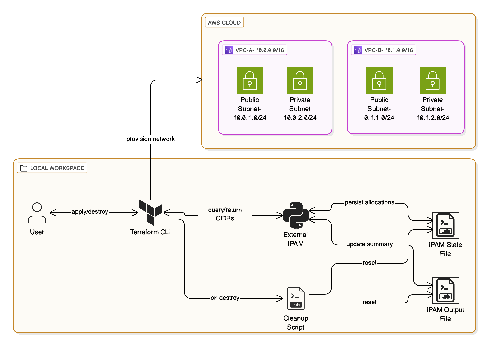

#  **Python-based External IPAM Provider for Terraform**

A lightweight and deterministic IP Address Management (IPAM) module. This tool dynamically allocates non-overlapping CIDR blocks for AWS VPCs and subnets **per Terraform workspace**, ensuring **clean separation between environments** (e.g., `staging`, `production`, etc.).

## Overview

This project provides a lightweight **IP Address Management (IPAM)** solution for Terraform, using a Python-based `external` data source.

It enables:

* Allocation of non-overlapping **/16 VPC CIDRs** per Terraform workspace.
* Automatic subdivision into **public/private /24 subnets**.
* Persistent state tracking (`ipam_state.json`).
* Human-readable allocation summary (`ipam_output.json`).
* Cleanup automation on `terraform destroy`.

---


---

## IPAM Logic Diagram

```text
┌──────────────────────────────-┐
│ Base CIDR (e.g., 10.0.0.0/16) │
└────────────┬────────────────-─┘
             │
             ▼
┌──────────────────────────────┐
│ Workspace: staging           │
│ VPC CIDR: 10.0.0.0/16        │
│ ┌──────────────┬────────────┐│
│ │ Public /24   │ Private /24││
│ │ (10.0.0.0/24)│ (10.0.1.0) ││
│ └──────────────┴────────────┘│
└──────────────────────────────┘
             │
             ▼
┌──────────────────────────────┐
│ Workspace: production        │
│ VPC CIDR: 10.1.0.0/16        │
│ ┌──────────────┬────────────┐│
│ │ Public /24   │ Private /24││
│ │ (10.1.0.0/24)│ (10.1.1.0) ││
│ └──────────────┴────────────┘│
└──────────────────────────────┘
```

---

## Repository Structure

<details>
<summary>Click to expand</summary>

```
.
├── LICENSE
├── .gitignore
├── .terraform.lock.hcl
├── main.tf                     # Root module entry point
├── providers.tf                # Provider setup (AWS, external)
├── variables.tf                # Global variables
├── locals.tf                   # Global local values
├── outputs.tf                  # Root outputs
├── terraform.auto.tfvars       # Env-specific configuration
├── ipam/
│   ├── ipam_provider.py        # Python logic for dynamic IP allocation
│   ├── ipam_state.json         # Persistent state of all CIDRs
│   └── ipam_output.json        # Workspace-specific summary
└── modules/
    └── network/
        ├── variables.tf
        ├── locals.tf
        ├── vpc.tf              # AWS resources (VPC, Subnets, IGW, NAT, etc.)
        ├── cleanup.tf          # IPAM state reset via null_resource
        └── outputs.tf
```

</details>

---

## Requirements

* [Terraform](https://www.terraform.io/) ≥ **1.11.4**
* **Python 3.x**
* Configured AWS CLI (credentials + default region)

---

## Provider Configuration

```hcl
terraform {
  required_version = ">= 1.11.4"

  required_providers {
    aws = {
      source  = "hashicorp/aws"
      version = "~> 5.0"
    }
    null = {
      source  = "hashicorp/null"
      version = "~> 3.0"
    }
  }
}

provider "aws" {
  region = var.project_settings.aws_region
}
```

---

## Quickstart

```bash
# Create new workspace (e.g., staging)
terraform workspace new staging

# Deploy infrastructure with IPAM-based CIDRs
terraform apply -auto-approve

# Check output CIDRs
cat ipam/ipam_output.json
```

---

## Advanced Usage

### Switch Environments

```bash
terraform workspace select production
terraform apply -auto-approve
```

Each workspace gets a unique `/16` CIDR block.

---

### Add More Subnets

Edit your `terraform.auto.tfvars`:

```hcl
network = {
  availability_zones = ["us-east-1a", "us-east-1b", "us-east-1c"]
}
```

Then reapply:

```bash
terraform apply -auto-approve
```

New `/24` blocks will be added under the existing `/16`.

---

## Cleanup

```bash
terraform destroy -auto-approve
```

This triggers the null resource in `cleanup.tf` to reset:

```bash
echo '{"allocated": {}, "subnet_allocations": {}}' > ipam/ipam_state.json
echo '{}' > ipam/ipam_output.json
```

---

## Contributing

1. Fork this repository
2. Create a new branch
3. Commit with descriptive messages
4. Format code (`black`, `terraform fmt`)
5. Submit a pull request

---

## License

Licensed under the [MIT License](LICENSE).
Feel free to use, extend, or adapt as needed.

